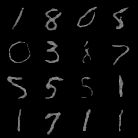

这是一个使用diffusion重建mnist和cifar10的例子。

只不过是没有condition的。

这个文件相比于之前实现的DDPM文件，应该是代码量更小。

alpha_t    ：$\alpha_t$

oneover_sqrt_alpha_t    ：$\frac{1}{\sqrt{\alpha_t}}$

sqrt_beta_t    ：$\sqrt{\beta_t}$

alphabar_t    ：$\bar{\alpha_t}$

sqrt_alphabar_t    ：$\sqrt{\bar{\alpha_t}}$

sqrt_1m_alphabar_t    ：$\sqrt{1-\bar{\alpha_t}}$

omabt_over_sqrt_1m_alphabar_t    ：$\frac{1 - \alpha_t}{\sqrt{1-\bar{\alpha_t}}}$

