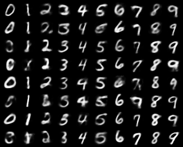
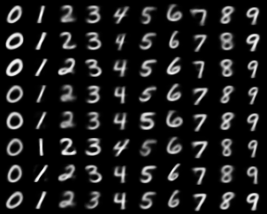

通过给编码器和解码器添加label embedding的方式
实现了条件VAE

在损失函数中，包含了两个部分：重构损失和KL散度

由于KL散度的计算是一个sum方法，
因此在计算重构损失时，reduction要设置为sum

通常情况下，重构损失部分会比KL散度部分大很多
所以可以通过beta值来进行调整。

## 关于beta
beta值越大，图像质量越好，但是多样性会降低
beta值越小，图像质量越差，但是多样性会增加
但是如果beta太小，就会导致潜在空间丧失良好的结构，正态分布的约束不足。

## 关于重构损失的损失函数
重构损失的损失函数是MSELoss
我也尝试了BCELoss，但是这个损失函数太容易梯度爆炸了，所以放弃了bce的方案

### 下面是一些实验结果，在mse的情况下，beta=1,epoch=12
  
### 在mse的情况下，beta=10,epoch=22  
